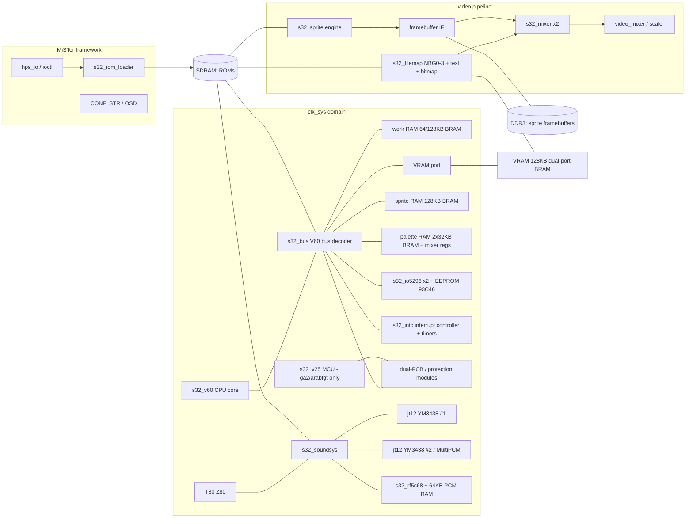

# Sega System 32 / Multi 32 — MiSTer FPGA Core: Design Document

| | |
|---|---|
| **Status** | Draft for review — v0.1 |
| **Target platform** | MiSTer (DE10-Nano, Cyclone V `5CSEBA6U23I7`) + 32 MB or larger SDRAM add-on |
| **Scope** | Every game in the MAME `segas32` driver: Sega System 32 (NEC V60) and Sega Multi 32 (NEC V70) boards, including clones |
| **Primary reference** | MAME `src/mame/sega/segas32.cpp`, `segas32_v.cpp`, `segas32_m.cpp`, `segas32.h` (BSD-3-Clause, Aaron Giles et al.) — treated as the de-facto hardware documentation throughout |
| **Deliverable of this document** | A complete, implementable specification of the core: architecture, per-module design, memory/bandwidth budgets, MiSTer integration, verification plan, and milestones |

## Table of contents

1. Executive summary, goals, non-goals
2. Target hardware profile & the System 32 / Multi 32 game library
3. System architecture & clocking
4. Memory system
5. Main CPU: NEC V60/V70 core
6. Video subsystem
7. Audio subsystem
8. Protection & per-game custom hardware
9. MiSTer platform integration
10. Resource & performance budget
11. Verification & compatibility plan
12. Development plan
13. Appendices (memory maps, register reference, ROM load maps, references)

---

## 1. Executive summary, goals, non-goals

### 1.1 What System 32 is

Sega System 32 (1990) is Sega's last and most powerful 2-D sprite-scaler arcade
platform before the 3-D Model era. It pairs a 32-bit NEC V60 CPU with an
exceptionally capable video chipset: four independently scrolling and zooming
tilemap layers, a text layer, a bitmap layer, and a frame-buffer-based sprite
engine capable of arbitrary per-sprite scaling, 8 bpp color, indirect palettes,
and shadows, all combined by a programmable 16-priority mixer with per-layer
color offset (fade) and blending. Audio is a Z80 driving two YM3438 FM chips
plus a Ricoh RF5C68-family 8-channel PCM chip.

Sega Multi 32 (1992) is the dual-monitor sibling: a faster NEC V70, the same
video chipset with two independent mixers/palettes driving two screens, and a
Sega 315-5560 "MultiPCM" 28-voice sample player replacing one YM3438 and the
RF5C68.

The library includes several of Sega's most celebrated 2-D arcade games:
Golden Axe: The Revenge of Death Adder, SegaSonic the Hedgehog, Spider-Man:
The Videogame, Arabian Fight, Burning Rival, Dark Edge, Alien3: The Gun,
Jurassic Park, Rad Mobile, Rad Rally, F1 Exhaust Note, F1 Super Lap, Air
Rescue, Dragon Ball Z V.R.V.S., Holosseum, Slip Stream, Super Visual Football,
and on Multi 32: OutRunners, Stadium Cross, Title Fight, and Hard Dunk.

No FPGA implementation of System 32 — or of the NEC V60 CPU — is known to
exist. This core breaks new ground in two places: a from-scratch V60/V70 CPU
core, and a faithful implementation of the 315-5385/5386A/5387/5388 video
chipset.

### 1.2 Goals

1. **Full library**: every game in the MAME `segas32` driver boots and plays
   correctly, including protected games (ga2, arabfgt, brival, darkedge,
   dbzvrvs, f1lap, sonic, jleague) and Multi 32 titles.
2. **Accuracy first**: behavior is specified against MAME's implementation and
   validated by automated co-simulation (CPU traces, frame captures). Where
   MAME itself is approximate (V60 cycle timing, CRT timing), this document
   says so explicitly and defines the chosen behavior.
3. **Great performance on DE10-Nano**: 60 fps native, no frame skips, audio
   without underruns, total latency ≤ 1 frame beyond original hardware.
4. **First-class MiSTer citizenship**: MRA-based ROM loading, per-game input
   mapping (wheels, pedals, lightguns, trackballs, 4/6-player adapters),
   93C46 EEPROM persistence, standard video/scaler options.

### 1.3 Non-goals (v1)

- **Save states** — deferred; the design keeps all architectural state
  accessible to make this feasible later (§12).
- **AS-1 laserdisc attraction** (`as1` sets) — requires laserdisc video,
  not-working in MAME; loadable but explicitly unsupported.
- **Soreike Kokology CD audio & card printer** (`kokoroj`, `kokoroj2`) — games
  boot and play; CD-audio streaming from SD and printer are stretch goals (§8.7).
- **Cabinet motion/air-drive outputs** (Rad Mobile deluxe, Jurassic Park
  deluxe) — output bits are captured and exposed on a debug interface only.
- **True twin-cabinet linking** of two physical MiSTers (OutRunners/Stadium
  Cross link play) — the on-board dual-PCB games (arescue, f1en) are handled
  per §8.6; networked linking between MiSTer units is out of scope.

### 1.4 Success criteria

The core ships when:
- The **acceptance checklist in §11.6 passes for all games** — attract mode,
  coin-up, full playthrough of at least one loop/stage set, sound comparison,
  and EEPROM settings persistence;
- Automated V60 co-simulation shows **zero architectural divergences** against
  MAME across the per-game trace corpus (§11.2);
- Fitting closes timing on the DE10-Nano at the clocks specified in §3 with
  ≥ 10% ALM headroom for fixes (§10).
---

## 2. Target hardware profile & the System 32 / Multi 32 game library

### 2.1 Board variants

The MAME driver models each PCB flavor as a device; the core mirrors this as
one FPGA design with per-game configuration loaded from the MRA:

| PCB device (MAME) | CPU | Extra hardware | Games |
|---|---|---|---|
| `segas32_pcb_regular` | V60 | — | holo, svf/svs/jleague |
| `segas32_pcb_analog` | V60 | MSM6253 4-ch ADC @ `0xc00050` | radm, radr, slipstrm, alien3, jpark, f1lap, dbzvrvs |
| `segas32_pcb_trackball` | V60 | 3× µPD4701A counters @ `0xc00040/48/50` | sonic, sonicp |
| `segas32_pcb_4player` | V60 | i8255 PPI @ `0xc00060` | spidman, brival, darkedge |
| `segas32_pcb_v25` | V60 | NEC V25 protection MCU + MB8421 dual-port RAM @ `0xa00000` | ga2, arabfgt |
| `segas32_pcb_upd7725` | V60 | µPD77P25 math DSP @ `0xa00000` (837-8341 board) | arescue (main PCB only) |
| `segas32_pcb_cd` | V60 | MB89352 SCSI @ `0xc00040`, CXD1095 I/O @ `0xc00060`, audio-CD drive, printer | kokoroj, kokoroj2 |
| dual-direct (2× PCB) | 2× V60 | shared-RAM bridge board between two full PCBs | arescue, f1en |
| `segas32_pcb_multi` | V70 | 2nd 315-5296 I/O, 2nd mixer+palette, 2 monitors, MultiPCM | titlef, harddunk (6p PPI), orunners/scross (analog + `analog_bank` @ `0xc00060`), as1 |

Key Sega custom ICs (single System 32 board): 315-5385 (tilemap address
generator), 315-5386A (sprite engine), 315-5387 (mixer), 315-5388 (pixel
data path), 315-5242 (color encoder/DAC hybrid), 315-5296 (I/O), ASSP 5C105
(= RF5C68/315-5476A PCM). Multi 32 adds a second 315-5388/5242 pair, a
315-5591, and the 315-5560 MultiPCM. VRAM is built from dual-port DRAMs
(HM53461/D42264) — an important hint that the video chips stream from VRAM
continuously while the CPU accesses the random port.

### 2.2 Complete game matrix

Parents with all clones from the MAME driver (63 sets across 24 parents).
"Config" is the PCB device above. All games are horizontal, 60 Hz nominal.

| Set | Title | Year | Config | Controls | Protection / special |
|---|---|---|---|---|---|
| `arescue` (+`arescueu`, `arescuej`) | Air Rescue | 1992 | dual-direct + µPD7725 | analog stick X/Y per PCB | math DSP (HLE §8.6); twin cab |
| `alien3` (+`alien3u`, `alien3j`) | Alien3: The Gun | 1993 | analog | 2× positional gun via ADC (X/Y per player) | gun recoil outputs |
| `arabfgt` (+`arabfgtu`, `arabfgtj`) | Arabian Fight | 1991 | V25 (`arf` opcode table) | 4P × (8-way + 3 buttons) | V25 protection MCU |
| `brival` (+`brivalj`) | Burning Rival | 1992 | 4-player board | 3P × (8-way + 4 buttons) | ROM-string protection (HLE §8.3) |
| `darkedge` (+`darkedgej`) | Dark Edge | 1992 | 4-player board | 2P × (8-way + 6 buttons) | FD1149 "live" workram writes at vblank (HLE §8.4) |
| `dbzvrvs` | Dragon Ball Z V.R.V.S. | 1994 | analog | 2× analog stick | workram-copy protection (HLE §8.4) |
| `f1en` (+`f1enu`, `f1enj`) | F1 Exhaust Note | 1991 | dual-direct | wheel + 2 pedals per PCB | twin cab (shared-RAM bridge) |
| `f1lap` (+`f1lapt`, `f1lapj`) | F1 Super Lap | 1993 | analog | wheel + 2 pedals | FD1149 vblank writes (HLE §8.4); `f1lapt` factory-unprotected |
| `ga2` (+`ga2u`, `ga2j`) | Golden Axe: The Revenge of Death Adder | 1992 | V25 (`ga2` opcode table) | 4P × (8-way + 3 buttons) | V25 protection MCU |
| `holo` | Holosseum | 1992 | regular | 2P × (8-way + 2 buttons) | no tile ROMs — bitmap+sprites only; `ORIENTATION_FLIP_Y` |
| `jpark` (+`jparkj`, `jparkja`, `jparkjc`) | Jurassic Park | 1993 | analog | 2× positional gun via ADC | vblank nudge (HLE §8.4); motion-cab outputs |
| `kokoroj` (+`kokoroja`) | Soreike Kokology | 1992 | CD | 2P buttons + mic | audio CD undumped → not-working in MAME |
| `kokoroj2` | Soreike Kokology Vol. 2 | 1993 | CD | 2P buttons + mic | audio CD dumped; printer unemulated |
| `radm` (+`radmu`) | Rad Mobile | 1990 | analog | wheel, accel, brake + 3 switches (lights/wiper/shift) | motor outputs; first appearance of Sonic (as air freshener) |
| `radr` (+`radru`, `radrj`) | Rad Rally | 1991 | analog | wheel, accel, brake, 4-pos shifter | EEPROM ships pre-initialized |
| `slipstrm` (+`slipstrmh`) | Slip Stream | 1995 | analog | wheel, accel, brake, shifter | Capcom-published; Brazil/Hispanic regions |
| `sonic` (+`sonicp`) | SegaSonic The Hedgehog | 1992 | trackball | 3P trackballs + 1 button each | rev C level-load protection (HLE §8.2); `sonicp` prototype unprotected |
| `spidman` (+`spidmanu`, `spidmanj`) | Spider-Man: The Videogame | 1991 | 4-player board | 4P × (8-way + 2 buttons) | — |
| `svf` (+`svfo`, `svs`, `jleague`, `jleagueo`) | Super Visual Football / J.League 1994 | 1994 | regular | 2P × (8-way + 3 buttons) | jleague team-select patch (HLE §8.5) |
| `harddunk` (+`harddunkj`) | Hard Dunk | 1994 | Multi 32, 6-player PPI | 6P × (8-way + 3 buttons), two screens | — |
| `orunners` (+`orunnersu`, `orunnersj`) | OutRunners | 1992 | Multi 32 analog | 2 cockpits: wheel/accel/brake + shifter + DJ/music buttons | `analog_bank` mux for 8 ADC channels |
| `scross` (+`scrossa`, `scrossu`) | Stadium Cross | 1992 | Multi 32 analog | 2 cockpits: bike bars (X + wheelie) + brake | comm board on `scrossa` (link) |
| `titlef` (+`titlefu`, `titlefj`) | Title Fight | 1992 | Multi 32 | 2 cockpits: 2× punch stick (X/Y each) | — |
| `as1` (+`as1a/b/c`) | AS-1 Controller | 1993 | Multi 32 | — | laserdisc theater controller — **unsupported** (§1.3) |

### 2.3 ROM topology and maxima (drives SDRAM sizing, §4)

Region sizes from the MAME ROM definitions (per parent; regions are
zero-padded to these sizes by mirroring/interleave at load time):

| Region | Typical | Maximum | Consumer | Access pattern |
|---|---|---|---|---|
| `maincpu` (V60/V70 program+data) | 2 MB | **2 MB** (`0x200000`) all games | V60 core | 16-bit random reads (V60), 32-bit (V70) |
| `soundcpu` (Z80 program + banked data) | 1–4 MB | **4 MB** (`0x400000`) System 32 games; 512 KB on Multi 32 | Z80 | 8-bit reads, banked window |
| `tiles` (16×16 4 bpp chars) | 1–4 MB | **4 MB** (`0x400000`) | tilemap engine | sequential 64-bit-per-row bursts |
| `sprites` (32-bit-interleaved object data) | 4–16 MB | **16 MB** (`0x1000000`) | sprite engine | 32-bit streaming bursts, ROM_REGION32_BE |
| `sega` (MultiPCM samples, Multi 32 only) | 4 MB | **4 MB** (`0x400000`) | MultiPCM | random byte reads, 28 voices |
| `mcu` (V25 protection program, ga2/arabfgt) | 64 KB | 64 KB | V25 core | 8-bit, address-descrambled at load |
| `dspprg`/`dspdata` (µPD77P25, arescue) | 8 KB / 2 KB | — | HLE module (§8.6) | n/a |
| `eeprom` (factory 93C46 image, radm/radr/alien3) | 128 B | 128 B | EEPROM model | loaded as NVRAM default |

Worst-case single game (`ga2`, `jpark`, `f1lap`, …): 2 + 4 + 4 + 16 = **26 MB**
→ every game fits a 32 MB SDRAM module with room for the sprite framebuffer
(§4.4). 64 MB+ modules remove all pressure.

### 2.4 Notable per-game hardware quirks (must-handle list)

- **holo**: tile ROM region is empty — NBG layers never enabled; bitmap layer
  + sprites only, and the screen is vertically flipped (`ORIENTATION_FLIP_Y`).
  A correct bitmap layer is *required* for this game alone.
- **radm/radr/alien3**: ship with a factory EEPROM image (region `eeprom`);
  the MRA must preload NVRAM or the games boot into error/setup screens.
- **f1en (and arescue)**: two complete PCBs execute the same game; the boards
  exchange state through a bridge RAM (§8.6). Sound RAM must be initialized
  to `0xff` at power-on or f1en produces corrupted sound (MAME MT04531).
- **orunners**: uses 8 analog channels through a 4-channel ADC via an
  `analog_bank` register at `0xc00060`.
- **scross** dual bike handles: Y axis is a wheelie sensor, plus a shared
  brake pedal on channel 2 of each bank.
- **sonic**: three trackballs, each a µPD4701A X/Y quadrature counter pair
  with independent reset via read of `0xc00040/48/50` region.
- **Widescreen switching**: games select 320×224 or 416×224 at runtime via
  sprite-control register 6 (§6.8); radm switches between attract and gameplay.
---

## 3. System architecture & clocking

### 3.1 Top-level block diagram



### 3.2 Board clocks (from MAME/PCB documentation)

System 32 carries two crystals: **32.2159 MHz** (`MAIN_CLOCK`) and **50 MHz**.
Multi 32 carries **32 MHz**, **40 MHz** (`MULTI32_CLOCK`) and **50 MHz**.

| Consumer | System 32 | Multi 32 |
|---|---|---|
| V60 / V70 | 32.2159/2 = **16.10795 MHz** | 40/2 = **20 MHz** (V70) |
| Z80 | 32.2159/4 = **8.0540 MHz** | 32/4 = **8.0 MHz** |
| YM3438 (×2 / ×1) | 32.2159/4 = **8.0540 MHz** | 32/4 = **8.0 MHz** |
| 315-5296 I/O | 32.2159/4 | 32/4 (×2 chips) |
| RF5C68 PCM | 50/4 = **12.5 MHz** → sample rate 12.5 M/384 = **32.552 kHz** | — |
| MultiPCM (315-5560) | — | 40/4 = **10 MHz** |
| IRQ timer 0 | (32.2159 MHz/2), period = `0x800 × N` ticks, N = 12-bit | (32 MHz/2), same formula |
| IRQ timer 1 | (50 MHz/16 = 3.125 MHz), period = `0x100 × N` ticks | same |
| µPD77P25 DSP (arescue) | 16 MHz/2 (daughterboard XTAL) | — |
| V25 MCU (ga2/arabfgt) | 10 MHz (MAME approximation) | — |

### 3.3 FPGA clock plan

Two PLL output clocks; everything else is derived with clock enables:

| FPGA clock | Frequency | Purpose |
|---|---|---|
| `clk_ram` | **96.648 MHz requested; ~96.634615 MHz generated** | SDRAM controller, DDR3 interface logic, sprite engine datapath |
| `clk_sys` | **48.324 MHz requested; ~48.317307 MHz generated** | everything else; fractional CEs divide to the board-rate targets (V60, Z80/YM, RF5C68, V25) |

Rationale:
- A single-edge-related 2:1 pair keeps all CDC between `clk_sys` and `clk_ram`
  synchronous (no async FIFOs on the hot paths).
- MiSTer's PLL reconfig switches the pair for Multi 32 to a 40 MHz-derived set
  (`clk_sys` = 60 MHz = 3 × 20, `clk_ram` = 120 MHz) *or* — preferred to keep
  one timing closure — the V70 runs from a 20 MHz CE inside the same
  48.324/96.648 MHz plan with a fractional CE (20/48.324). **Decision:
  fractional CEs from fixed clocks.** A fractional-N CE (accumulator-based)
  gives long-term-exact average frequency; the V70 is not cycle-locked to
  video (interrupt-driven), so short-term jitter of one `clk_sys` period is
  harmless and this avoids two timing corners. The same technique clocks the
  RF5C68 (12.5 MHz average via accumulator on 48.324 MHz) and Z80 on Multi 32
  (8.0 vs 8.054).
- Audio/CRT crystals aren't integer-related on the real board either
  (32.2159 vs 50 MHz), so nothing on the board relies on their phase.

`clk_vid` is not a separate PLL clock: the pixel clock is generated as a CE
(§6.8) and the MiSTer scaler consumes `CE_PIXEL`.

Reset strategy: the game reset combines framework/OSD reset, PLL lock, and
the loader's `rom_loaded` gate. `rom_loaded` rises only after a real index-0
transaction has ended and its last SDRAM write acknowledgement has drained,
so no subsystem executes partial ROM contents. Loader state itself resets on
PLL loss rather than a game soft-reset, preserving the completed-ROM gate.
The FM fractional NCO runs whenever the PLL is locked, including throughout
this board/ROM-load reset. JT12's resettable operator/envelope rings advance
only with its enabled clock; stopping that CE during reset leaves unknown
state in the production YM outputs. Its 24-slot operator sequencer is also
synchronously reset in production RTL rather than relying on JT12's former
simulation-only initializer. The Z80 and other board CEs remain halted
normally during reset.
The Z80 is additionally reset by 315-5296 CNT2 (game-controlled, inverted),
and sprite control register writes are unaffected by Z80 reset.

### 3.4 Board-variant configuration

The MRA starts ioctl index 0 with a 64-byte board descriptor. Byte 0 contains
`{multi32, has_v25, v25_table_sel, has_adc, has_track, has_ppi, has_dsp_hle,
has_cd_stub}` in ascending bit order. Byte 1 bit 0 selects the dual-PCB bridge
and bit 1 requests final cabinet Y orientation (set for Holosseum). Byte 2 is
the protection selector. Byte 3 bit 7 validates physical sprite-bank metadata
and bits 1:0 hold the bank mask (`0/1/3` for 4/8/16 MiB). Remaining bytes are
reserved. Release profiles may compile out descriptor-unreachable blocks.

---

## 4. Memory system

### 4.1 Physical memories

| Store | Size | Location | Why |
|---|---|---|---|
| V60 work RAM | 64 KB (S32) / 128 KB (M32) | BRAM | random 16/32-bit access every CPU cycle |
| VRAM (tilemaps/text/bitmap + video regs) | 128 KB | BRAM, true dual port | CPU port + continuous fetch by tilemap engine; real board uses dual-port DRAM |
| Sprite (object list) RAM | 128 KB | BRAM, dual port | CPU port + sprite-engine list walker; double-buffer semantics are *internal to the sprite engine's list latch*, the RAM itself is single-image |
| Palette RAM | 2 × 32 KB (bank 0 / bank 1-Multi32) | BRAM, dual port | CPU read-modify-write + per-pixel mixer lookups (2 reads/pix worst case for blending) |
| Z80 shared RAM | 8 KB | BRAM, dual port | V60 window `0x700000`, Z80 `0xe000–0xffff` |
| RF5C68 wave RAM | 64 KB | BRAM | Z80-visible 4 KB window + 8-voice fetch |
| V25 RAM + MB8421 DPRAM | 4 KB | BRAM | ga2/arabfgt |
| EEPROM 93C46 | 128 B | explicit dual-port M10K + ioctl download/upload | inverted 64×16 storage gives erased `0xFFFF` from zero power-up; index-2 defaults plus index-3 load/save persistence; physical round trip pending |
| **ROMs (all regions)** | ≤ 26 MB | **SDRAM** | see §2.3 |
| **Sprite framebuffers** | 2× (S32) / 4× (M32) 512×256×16 bit = 256 KB each | **DDR3** (§4.4) | too large for BRAM alongside the rest |

BRAM totals in §10.1.

### 4.2 SDRAM map and arbiter (`s32_sdram_arb`)

Static layout (fits 32 MB):

| Base | Size | Region |
|---|---|---|
| `0x000_0000` | 2 MB | `maincpu` |
| `0x020_0000` | 4 MB | `soundcpu` (Z80 banked) |
| `0x060_0000` | 4 MB | `tiles` |
| `0x0A0_0000` | 4 MB | `sega` (MultiPCM) — unused on S32 |
| `0x0E0_0000` | 2 MB | spare / V25 mirror / future |
| `0x100_0000` | 16 MB | `sprites` |

The ROM-download write port has priority while game logic is held reset. Once
running, the six read clients use bounded round-robin arbitration on `clk_ram`;
the starting client advances after every grant, so continuous CPU traffic
cannot starve sprite, tile, sound, or V25 reads. Transfers remain:

1. **V60 instruction/data fetch** (latency-critical): 16-bit, single-word CAS
   with an 8-word (16-byte) direct-mapped prefetch line + a small 4-line
   I-stream cache (§5.6). Worst-case service ≤ 8 `clk_ram` cycles.
2. **Tile fetch** (hard real-time): one 64-bit burst (4×16) fetches one 16-px
   row of one tile (§6.2); scheduled per-scanline with a line-ahead FIFO —
   deadline miss is impossible by construction (budget in §10.2).
3. **Sprite data fetch** (throughput): 8-word bursts, elastic FIFO.
4. **Z80 ROM fetch** (8-bit, ~4 MHz max rate): single word, low priority but
   bounded wait ≤ 1 µs (Z80 inserts wait states via `WAIT_n` if needed —
   in practice never at 8 MHz).
5. **MultiPCM fetch**: 28 voices × 32.552 kHz? No — MultiPCM output rate is
   Fs = 10 MHz/224 ≈ **44.643 kHz**; 28 voices × 1–2 bytes/sample ≈ 2.5 MB/s,
   single-word, deadline 1 sample period; a per-voice 4-byte prefetch makes
   this trivially schedulable.

The V25 (64 KB program, ga2/arabfgt) runs from its own BRAM copy loaded at
ioctl time (address-descrambled by the loader, §9.3), so it never touches
SDRAM at runtime.

### 4.3 Why the sprite framebuffer does not fit in BRAM

Sprite output resolution is up to 416×224. The engine renders into buffer A
while the mixer scans buffer B (double buffering, swap controlled by sprite
control regs / auto mode — §6.5). Storing pixels as 16 bit (15-bit payload +
"drawn" flag exactly like the hardware/MAME encoding):

- System 32: 2 × 512×256×2 B = 512 KB (rounded stride)
- Multi 32: 4 × = 1 MB

DE10-Nano's Cyclone V has ~700 KB of M10K total and §4.1 already commits
~500 KB. Therefore framebuffers live off-chip.

### 4.4 Framebuffer placement — DDR3, with SDRAM fallback

**Decision: DDR3 (HPS-attached) via the `DDRAM` interface.**

- Bandwidth need (worst case, Multi 32, both screens): mixer reads
  2×416×224×60×2 B ≈ 22 MB/s sustained + erase writes (same again) + render
  writes. Render fill rate budget is set by the render window: the real chip
  renders a full frame's list in one frame time; we budget **4 px/`clk_ram`
  cycle** peak write (byte-masked 64-bit DDR bursts) ≈ 770 MB/s peak, ~80 MB/s
  typical. DDR3 provides > 1 GB/s with the HPS bridge; latency (~150–250 ns)
  is absorbed by:
  - mixer side: per-scanline prefetch FIFO (whole sprite line fetched during
    previous line's active period);
  - render side: write-combining queue (sprites draw runs of consecutive
    pixels per row → natural bursts);
  - erase: performed as full-line writes (fill `0xffff`) — bursts.
- SDRAM fallback (for a hypothetical dual-SDRAM or 64 MB-only build) is kept
  behind the same `s32_fb_if` interface; feasible for single System 32
  (≈ 66 MB/s extra on the SDRAM bus) but not preferred: it couples sprite
  fill-rate to ROM traffic and risks the V60 latency budget.

`s32_fb_if` presents: `erase_line(y)`, `write_run(x,y,data[],mask[])`,
`read_line(y) → line buffer`. Two independent line buffers per screen decouple
mixer timing from DDR3 completely.

### 4.5 V60 bus decoding

Full System 32 memory map (V60 physical A23-A0, 16-bit data) and Multi 32
deltas are specified in Appendix A, reproduced from the MAME maps including
mirror masks. Highlights the RTL must honor:

- `unmap_value_high`: unmapped reads return `0xffff`.
- Mirrors are large and games use them (e.g., work RAM mirror `0x0f0000`,
  VRAM mirror `0x0e0000`, sprite control mirror `0x0ffff0`).
- `random_number_r` at `0xd80000–0xdfffff`: reads return LFSR noise (32-bit
  xorshift seeded at reset; games use it for RNG).
- Palette RAM has *two format aliases* selected by address bit 14 (§6.7) and a
  conditional write-both-banks behavior driven by mixer register `0x4e`
  bits `0x0880` — implemented in the palette write port, not in the CPU.
- ROM appears both at `0x000000–0x1fffff` and mirrored at `0xf00000–0xffffff`
  (V60 reset vector fetch at `0xfffff0`).
---

## 5. Main CPU: NEC V60/V70 core (`s32_v60`)

This is the highest-risk, highest-effort module: no open-source V60 RTL
exists. The reference behavior is MAME's `v60` core (instruction-accurate,
approximate cycle timing), cross-checked against the NEC µPD70616/µPD70632
programmer's manuals.

### 5.1 Device variants on these boards

| | System 32 | Multi 32 |
|---|---|---|
| Device | µPD70616 (V60) — Slip Stream PCB shows `D70616R-16` | µPD70632 (V70) — Title Fight PCB shows `D70632R-20` |
| External data bus | 16 bit | 32 bit |
| External address bus | 24 bit | 32 bit (24 used) |
| Clock | 16.108 MHz | 20 MHz |
| Byte order | little-endian | little-endian |

### 5.2 Programmer-visible state (must implement)

- 32 × 32-bit general registers R0–R31; R31 = SP with **four banked stack
  pointers** ISP/L0SP–L3SP selected by PSW execution level; R29 = FP, R30 = AP
  by convention (no hardware aliasing beyond SP banking).
- PSW: flags (Z, S, OV, CY), execution level (0–3), interrupt-enable/priority
  fields; `UPDPSW`/`GETPSW` instructions manipulate it directly.
- Privileged registers: ISP, L0SP–L3SP, SBR (system base = vector table
  base), SYCW (system control word: current/previous level, virtual mode
  bits), TKCW (task control word), TR (task register), PIR (processor ID),
  ADTR0/1 + ADTMR0/1 (address trap regs), PSW2 (V70).
- **Not needed by known System 32 software:** MMU/virtual paging (games run
  real-mapped; SYCW virtual bit stays 0), FRM multiprocessor function,
  V20/V30 emulation mode, and the floating-point instruction set. MAME does
  implement a small single-precision subset in groups `0x5c`/`0x5f`, but no
  System 32 game is known to execute it. The RTL currently sends those FP
  groups to the reserved-instruction exception and logs them in simulation;
  this is an explicit arcade-profile exclusion, not a claim that MAME lacks
  floating-point execution.

### 5.3 Instruction set and encoding

The V60 ISA is a two-address CISC with fully general addressing on both
operands. Scope (from the MAME opcode tables):

- ~120 distinct mnemonics ≈ 250 opcode encodings across byte/half/word forms:
  data movement (MOV variants, MOVEA, MOVS/MOVT sign/zero extend), integer
  arithmetic (ADD/ADDC/SUB/SUBC/CMP/MUL/MULU/DIV/DIVU in 8/16/32-bit forms,
  MULX/DIVX 64-bit), logic/shift/rotate (AND/OR/XOR/NOT/SHL/SHA/ROT/ROTC),
  **bit-field instructions** (INSBFR/INSBFL/EXTBFS/EXTBFZ/EXTBFL, CMPBF*,
  bit set/clear/test/not), **string/block ops** (MOVC/MOVCF/MOVCS, CMPC*,
  SRCHC*, SCHC — interruptible, with per-element loops), decimal adjust,
  CHKA/CHLVL, branch/jump/call (Bcc with 15 condition codes, BR/JMP/JSR/BSR
  8/16/32-bit displacements), stack/frame (PUSH/POP/PUSHM/POPM/PREPARE/
  DISPOSE), system (TRAP/TRAPFL, RETIU/RETIS, HALT, CLRTLB…, privileged
  moves to/from system registers), and TASI (test-and-set) used for
  V60↔Z80 synchronization.
- Operand encoding: each operand is a "mode byte" + extensions. Addressing
  modes: register, register-indirect, autoincrement/decrement,
  displacement(8/16/32)[reg], double displacement, PC-relative(8/16/32),
  absolute, immediate (quick 4-bit and full-width), **double-indirect
  (deferred)** forms of most of the above, and scaled-index forms. The MAME
  decoder factors this into three operand-decode families (`am1/am2/am3`);
  the RTL mirrors that factoring (§5.4).

### 5.4 Microarchitecture

A microcoded, sequential (non-pipelined beyond prefetch) implementation —
correctness and verifiability over IPC; the timing target (§5.6) does not
require pipelining.

```
        +------------------+
  bus <-| prefetch queue   |--> decode ROM (1st byte + mode bytes)
        |  (2x16B lines)   |          |
        +------------------+          v
        +-----------------------------------------+
        | micro-sequencer:                        |
        |  uPC, call/return stack (2 deep)        |
        |  shared microroutines:                  |
        |   - EA calc (per addressing mode)       |
        |   - operand load (B/H/W, deferred)      |
        |   - operand store                       |
        |   - exception/interrupt entry           |
        +-----------------------------------------+
              |            |             |
              v            v             v
        register file   ALU 32b       bus unit
        32x32 (BRAM,    +barrel       (16b V60 /
        2R1W, banked    shifter,      32b V70,
        SP shadow)      flags         unaligned
                        MUL/DIV       sequencer)
                        (DSP blocks,
                         iterative DIV)
```

Key decisions:

- **Microcode in BRAM** (~2–4 K × 40-bit words, generated from a Python
  assembler checked into the repo). Every instruction = entry-point +
  shared EA/load/store microroutines; bit-field and string instructions are
  microcoded loops (interruptible at element boundaries exactly like silicon —
  PC restarts the instruction with saved intermediate state in scratch
  registers, matching MAME's element-wise implementation).
- **Unaligned access**: V60 allows any alignment; the bus unit decomposes
  into 1–3 16-bit cycles (V60) or 1–2 32-bit cycles (V70) transparently to
  microcode.
- **Prefetch**: 2 × 16-byte lines with sequential prefill from SDRAM cache
  (§4.2); flushed on branches. This mimics the real part's queue closely
  enough for timing while keeping fetch simple.
- **MUL/DIV**: 32×32 multiply in DSP blocks (2 cycles), divide as 1-bit/cycle
  iterative (32–38 cycles) — comfortably inside the real chip's timing
  (real V60 DIVW ≈ 40+ cycles).
- **Exceptions**: reserved-instruction, privileged-instruction, zero-divide,
  TRAP/TRAPFL, address-trap (ADTR — implemented but unused by games), plus
  external NMI (vector 2) and maskable IRQ. Exception entry pushes per the
  V60 format (PSW + PC, level switch to ISP) — encoded as one microroutine.

### 5.5 Interrupt interface (System 32 specifics)

The board has **no interrupt controller chip**; a 5-source latch + mask +
vector file lives at `0xd00000` (§Appendix A, `s32_intc`):

- Sources: 0 = VBLANK-start, 1 = VBLANK-end, 2 = sound (Z80 doorbell),
  3 = timer 0, 4 = timer 1.
- Registers (byte-wide at even addresses): offsets 0–4 = vector number for
  each source, 5 = unknown/scratch, 6 = mask (1 = masked), 7 = pending
  (write = AND-clear ack), 8/9 and 10/11 = timer 0/1 12-bit reload values
  (write restarts timer), 12–15 = **write signals IRQ to the Z80**.
- `IRQ` asserted while `(pending & ~mask & 0x1f) != 0`. During the CPU's
  interrupt-acknowledge microroutine it reads the **lowest-numbered** pending
  unmasked source's vector register; the CPU then takes **vector = value +
  0x40**, i.e. table entry at `SBR + 4×(vector+0x40)`. NMI (unused on S32)
  is vector 2.
- Timer 0 period = `0x800 × N / (MAIN_CLOCK/2)`; timer 1 period =
  `0x100 × N / (50 MHz/16)` — implemented as programmable dividers off the
  exact CE sources, not attotime approximations.

### 5.6 Timing model

MAME's V60 cycle counts are approximate; games are interrupt/vblank paced and
tolerate moderate CPI differences (they ran on 16 MHz silicon with DRAM wait
states). Policy:

1. Implement the **documented per-instruction base cycles** from the NEC
   manual where known, else MAME's table.
2. Add real memory wait states from our bus (BRAM = 0-wait; SDRAM via the
   prefetch/cache — target ≥ 95% fetch hit, miss ≈ 8 `clk_ram`).
3. Ship an OSD **"CPU turbo"** off by default; and a **"compat throttle"**
   letting us scale CPI ±25% if a game proves timing-sensitive during the
   compatibility pass (§11.6). This is a tuning valve, not a crutch: any game
   that needs it gets a root-cause investigation logged as an issue.

### 5.7 V70 delta (Multi 32)

Same ISA and microcode; differences are confined to the bus unit (32-bit
data path, different unaligned decomposition), 20 MHz CE, and full 32-bit
address decode (Multi 32 map uses `umask32` byte lanes on I/O — Appendix A).
Estimated extra cost: ~10% of the CPU module.

### 5.8 Verification (summary; full plan §11.2)

- Instruction-level co-simulation against MAME (patched to emit
  architectural-state traces) over: directed per-opcode tests (self-written
  V60 assembly), randomized instruction streams (constrained generator), and
  full-game traces (first 10⁸ instructions of every game booting).
- The Verilator harness runs `s32_v60` against recorded bus images so CPU
  verification is independent of the rest of the core.
- Acceptance: zero architectural divergence; cycle-count within ±20% of the
  real-hardware-derived budget on the macro benchmarks (per-frame instruction
  counts of running games).
---

## 6. Video subsystem

The chipset (315-5385 tilemap addressing, 315-5386A sprites, 315-5387 mixer,
315-5388 pixel path, 315-5242 color encoder) is implemented as three RTL
blocks: `s32_tilemap` (NBG0-3 + TEXT + BITMAP from VRAM), `s32_sprite`
(list processor + framebuffer renderer), `s32_mixer` (per-pixel priority
resolution, palette, color offset, blending). Multi 32 instantiates two
mixers/palettes and shares the tilemap and sprite engines exactly like the
hardware (sprites carry a per-sprite "monitor" bit).

All register/bit-level statements below are taken from MAME `segas32_v.cpp`
(they are restated fully in Appendix C so the RTL can be written from this
document alone).

### 6.1 VRAM organization

128 KB, 16-bit words. Pages of **32×16 tiles of 16×16 px** (= 512×256 px per
page, `0x200` words per page name table, 128 pages). The upper `0x100` words
(`0x31ff00–0x31ffff` CPU addresses) are the video register file (Appendix C):
per-layer enables/flips (`$1FF00/$1FF02/$1FF8E`), rowscroll/rowselect control
(`$1FF04`), clip selects (`$1FF06`), per-layer X/Y scroll (`$1FF12–$1FF2E`),
X/Y center for zoom (`$1FF30–$1FF3E`), 2×2 page selects per layer
(`$1FF40–$1FF4E`, 7-bit page numbers), NBG0/1 X/Y zoom steps
(`$1FF50–$1FF5A`, `0x200` = 1.0), text page/bank (`$1FF5C`), backdrop
(`$1FF5E`), four clip rectangles (`$1FF60–$1FF7E`), bitmap scroll/palette
(`$1FF88–$1FF8C`).

Tile name entry: bit15 = Y flip, bit14 = X flip, bits 12:4 = palette color
(9 bits, overlapping), bits 12:0 = tile index (13 bits into a 4-bank space:
`tilebank[1:0] = {external_io_portH[0], $1FF00 bit10}` selects which 8K-tile
bank the 13-bit index addresses — 32 K tiles max = the 4 MB region).

Text tile entry: bits 15:9 = palette (7 bits), bits 8:0 = character index;
characters are 8×8×4 bpp **stored in VRAM itself** (bank from `$1FF5C`
bits 2:0), not in tile ROM. Text name table = 64×32.

Bitmap layer (used by holo, dbzvrvs): linear VRAM bitmap, 4 bpp (with 9-bit
X/Y scroll) or 8 bpp (8-bit Y scroll), palette base from `$1FF8C`
(`(value << 4) & 0x1fff0`, masked by format), enabled/clipped via `$1FF02`.

### 6.2 Tilemap engine (`s32_tilemap`)

Per scanline, for each enabled NBG layer (worst case 4):

1. Compute source Y: `ysrc = (yscroll + line)` for NBG2/3;
   NBG0/1 additionally apply Y zoom: `ysrc = ycenter + (line - ycenter) ×
   ystep/0x200` (16.16 accumulator per layer, re-seeded each frame; X uses an
   identical accumulator walked per pixel).
   NBG2/3 instead support **rowscroll/rowselect**: when enabled by `$1FF04`,
   per-line X scroll and/or per-line source-row substitution are read from a
   VRAM table block at `($1FF04 >> 10) × 0x400` words — 256-entry per-line
   tables: rowscroll at +0x000 (NBG2)/+0x100 (NBG3), rowselect at
   +0x200/+0x300 (layout verified from MAME `update_tilemap_rowscroll`,
   Appendix C.4).
2. Page lookup: virtual 1024×512 space from the 2×2 page selects; page
   wrap / clip-window behavior per `$1FF02` bits (wrap-disable + inside/
   outside select per layer, using clip rect chosen by `$1FF06`).
3. Fetch name-table word from VRAM (dual-port, engine-side port), fetch pixel
   row: one 16×16×4 bpp tile row = 8 bytes = one 64-bit SDRAM burst.
   A 2-line-deep tile-row cache (per layer) makes each tile row fetched once
   per 16 (or fewer, zoomed) lines it's displayed.
4. Emit 4-bpp pixel + 9-bit tile palette + layer id into the layer line
   buffer; pen 0 = transparent (except "opaque" mixer modes, §6.6).

Fixed-function fetch order NBG0→3, TEXT (from VRAM directly, no SDRAM),
BITMAP (VRAM linear) — all into 7 parallel line buffers (dual-line,
ping-pong), consumed by the mixer one line later. **Every layer is rendered
every line** — no "layer is disabled" bandwidth dependence, so worst case =
steady state (budget §10.2).

Global flip (`$1FF00` bit 9, plus per-layer flip bits 3:0 and text-flip
inhibit bit 8) inverts fetch coordinates; on Multi 32 flip applies per
screen (verified against titlef which flips screen 2 content... **OPEN:**
MAME applies one global flip; dual-cab behavior to be confirmed during
compatibility pass).

### 6.3 Sprite engine (`s32_sprite`)

Frame-buffer sprite renderer, faithful to the 315-5386A command list:

**List format** (sprite RAM, 8 words per entry, up to 0x2000 entries space):

```
+0  cc------ --------   command: 0=draw, 1=set clip, 2=jump, 3=end
    --i----- --------   indirect palette enable
    ---l---- --------   indirect palette table is inline (words +8..+15)
    ----s--- --------   shadow sprite
    -----r-- --------   pixel data from sprite RAM (not ROM)
    ------8- --------   8 bpp
    -------o --------   opaque (pen 0 draws)
    -------- yx------   Y/X flip
    -------- --YX----   apply Y/X offset from last jump
    -------- ----aaAA   Y/X alignment (00 center, 10 start, 01 end)
+1  hhhhhhhh wwwwwwww   source height / width (×8px units; 8bpp width uses bits 5:0)
+2  rrrr---- --------   ROM bank low bits;  -----hhhhhhhhhhh onscreen height
+3  -5--4--- --------   ROM bank bits 5,4;  -----wwwwwwwwwww onscreen width
        (Multi 32: bank = {bit15,bit13}, bit11 = target monitor select)
+4  ----yyyyyyyyyyyy    Y position (12-bit signed)
+5  ----xxxxxxxxxxxx    X position (12-bit signed)
+6  oooooooooooooooo    offset within sprite bank: 20-bit 32-bit-word address = {word+2 bits 15:12, this word}; banks are 4 MB (1M words), up to 4
+7  -ppppppp pppp----   palette (4bpp: bits 14:4; 8bpp: bits 14:8)
    -------- ----rrrr   priority group bits (consumed by mixer)
```

- **Zoom** is ratio-implied: source w/h vs onscreen w/h; the renderer steps a
  source accumulator per destination pixel/line (matches MAME's
  `draw_one_sprite` divider behavior, including the alignment adjustments).
- **Indirect palettes**: 16-entry table (inline or at `spriteram[8×(word7 &
  0x1fff)]`), giving per-row 16-color remap (4 bpp) or bits 7:4 remap (8 bpp);
  entries carry their own priority-transparency semantics via `transmask`
  (Appendix C.6 reproduces the 4×4 `transparency_masks` table and sprite
  control registers 8/10 that select it).
- **Clip windows**: command 1 entries update in/out clip rectangles used by
  subsequent draws.
- **Framebuffer pixel format** = `0x8000 | palette<<shift | pen`, erase value
  `0xffff`; shadow sprites instead clear bit 15 of the existing pixel
  (creating the `0x7ffe`-pattern shadow pens the mixer detects).
- **Buffering/control** (`0x500000`, byte regs, Appendix C.7): reg2 latched
  X/Y flip of rendering direction; reg3 manual/auto + 30/60 Hz auto swap;
  reg0 write `bit1` = swap request, `bit0` = erase request; reg0 read = which
  buffer is displayed, reg1 read = render status (overdraw flag when list
  exceeds frame budget); reg6 = screen width select (416/320). Swap+erase are
  performed in vblank; rendering of the (double-buffered latched) list then
  proceeds — the engine keeps its own latched copy of the 8 control bytes at
  swap time, exactly like MAME's `sprite_control_latched`.
- **Multi 32**: word +3 bit 11 routes each sprite to monitor A/B framebuffer.

Renderer throughput: 2 pixels/`clk_ram` sustained (dual write-combine lanes)
≈ 193 Mpx/s at 96.6 MHz — comfortably above the original's fill rate (its
whole-frame budget at ~8 MHz pixel-ish rates), so "overdraw" status
(reg 1 = 2) is expected to be *rarer* than hardware; the status register is
still modeled from the actual remaining-budget counter so games that poll it
behave. **OPEN:** exact hardware fill rate is undocumented; if a game is
found to *depend* on overdraw timing (none known), a fill-rate throttle CE
will be calibrated then.

### 6.4 Sprite ROM data path

Sprite pixel data is stored 32-bit big-endian interleaved across 4 ROMs
(`ROM_REGION32_BE`), up to 4 banks × 4 MB; `fromram` sprites read the
32-bit-repacked sprite RAM instead (the RTL serves both from one address
generator; sprite RAM is repacked on the fly through a shadow port —
MAME's `spriteram_32bit` mirror). 4 bpp mode consumes 8 px/word, 8 bpp
4 px/word, with X-flip handled by reversed nibble/byte extraction.

### 6.5 Frame sequencing

- VBLANK-start IRQ (source 0) fires at line 224; VBLANK-end (source 1) at
  line 0 (both through `s32_intc`).
- Sprite swap/erase occur during vblank per control regs; the render window
  is the full frame (engine renders into the back buffer while the mixer
  displays the front buffer).
- Tilemap/video registers are CPU-written into VRAM at any time; scroll and
  zoom values are **latched per scanline** by the fetch engine (hardware
  streams from dual-port VRAM continuously — mid-frame writes take effect on
  the next line, giving correct raster effects for f1lap/orunners roads and
  titlef's line-window ring, via the rowscroll/rowselect path).

### 6.6 Mixer (`s32_mixer`, one per screen)

Register file: `0x610000` (screen 0) / `0x690000` (screen 1, Multi 32),
64 words, full map in Appendix C.8. Behavior implemented exactly as MAME's
`mix_all_layers`:

- Layer priority: TEXT/NBG0-3/BITMAP each have `priority[3:0]` (0 = layer
  off), `palette-base[7:4]`, `mixshift[9:8]` in regs `0x20–0x2A`; BACKGROUND
  from `0x2C`; sprites take priority per **sprite group** — the group is
  extracted from framebuffer pixel bits `[14:10+]` per the mode table in reg
  `0x4C` low nibble (16 modes: group width 0–4 bits at shift 10–14, with
  forced-group modes), each group's priority/palbase/shift in regs
  `0x00–0x1E`. Effective priority = `{priority, fixed_layer_rank}` with
  ties broken by rank SPRITE > TEXT > NBG0 > NBG1 > NBG2 > NBG3 > BITMAP >
  BACKGROUND (rank encodes MAME's `(prio<<3)|(6-laynum)` ordering, sprites
  `|7`).
- The RTL evaluates all 8 candidate layers combinationally per pixel
  (line-buffer reads), selects the winner, then applies:
  - **Sprite shadow**: winner-is-sprite with shadow pen pattern (`0x7ffe`
    group-masked, enabled by reg `0x4C` bit 2) → halve the *underlying*
    color (implemented as RGB shift after palette lookup of the layer below —
    requires the mixer to also resolve the runner-up pixel; the two-candidate
    resolve is the main mixer pipeline subtlety and is specified in C.8).
  - **Palette lookup**: index = `palbase + ((pen >> mixshift) & 0xFFF0) +
    (pen & 0xF)`, wrapped to 14 bits, into the screen's 0x4000-entry palette
    (15-bit color). The low nibble is deliberately never shifted.
  - **Color offset**: signed 6-bit per-channel offsets, two banks
    (regs `0x40–0x4A`) selected per layer by reg `0x3E` bits + per-layer
    flag bits (grayscale modes per `compute_color_offsets` — C.8).
  - **Blending**: when reg `0x4E` bit 11 set, layers whose `blendmask`
    (regs `0x30–0x3A` bits 13:6) matches the runner-up layer, or sprites
    matching the per-layer `sprblendmask` encoding (bits 5:0: eq/le/ge/always
    vs sprite priority), mix `((7-factor) × front + (factor+1) × back) / 8`
    (factor = reg `0x4E` bits 10:8). This is what radm/radr/jpark use for
    fades and water. Signed color offsets are applied before this arithmetic;
    the channels are clamped only after blend and shadow.
- Backdrop color: VRAM `$1FF5E` (not mixer register `$5E`) selects the static
  or per-line CRAM entry. The control is snapshotted at the scanline boundary.
- Display enable: 315-5296 CNT1 blanks the screen (black) when low.

### 6.7 Palette (`s32_palette`, per screen)

- 0x4000 entries × 15-bit xBGR (`xBBBBBGGGGGRRRRR`) in the low alias; the
  **high alias (CPU A14 = 1) presents the same entries reformatted as
  `xBGRBBBBGGGGRRRR`** (RGB444 + high bits) — conversion is pure
  combinational on the CPU port.
- When mixer reg `0x4E & 0x0880` ≠ 0, CPU writes also mirror into
  `offset ^ 0x2000` (blend pair), duplicated by the palette write port.
- Physical: one BRAM per screen, CPU port + one registered mixer read port.
  Winner and runner-up reads are time-multiplexed at 2× the system clock;
  the first address is issued at winner selection, the second at pipeline P0,
  and the first result is retained at P2 so both 2:1 clock phases are safe.
- Final 15-bit color + offsets → 24-bit RGB output (5→8 bit expansion after
  signed-offset clamp), matching the 315-5242 DAC hybrid.

### 6.8 CRT timing and resolution switching

MAME uses simplified timing: **416×224 visible in a 52-char (416-px) ×
262-line frame at 60 Hz**, or 320×224 when sprite-control reg 6 selects
narrow mode. Real horizontal total/porch values are not documented in MAME.
Design values (to be validated against PCB measurements during §11.5):

| Mode | dot CE | H total | V total | H rate | V rate |
|---|---|---|---|---|---|
| 416 wide | 8.05398 MHz (MAIN/4) | 512 | 262 | 15.73 kHz | 60.04 Hz |
| 320 wide | 6.44318 MHz (MAIN/5) | 410 | 262 | 15.72 kHz | 59.98 Hz |

Both land within standard 15 kHz monitor tolerance and MiSTer scaler range;
`CE_PIXEL` switches glitch-free at vblank when reg 6 changes. **OPEN:**
confirm real dividers/totals; the choice only affects exact refresh (games
are vblank-paced, not free-running).

Multi 32 output (§9.6): both screens are always rendered; OSD selects
screen A, screen B, or side-by-side (832×224 into the scaler with pillarbox
aspect), mirroring MAME's `layout_dualhsxs`.

### 6.9 Latency

Pipeline depth: tilemap/sprite line buffers (1 line) + mixer (pixels) →
composite latency ≤ 2 lines versus the original's beam — well under the
1-frame goal; the MiSTer scaler adds its usual buffering (user-selectable
low-latency modes unaffected).
---

## 7. Audio subsystem

### 7.1 Topology

**System 32**: Z80 (8.054 MHz) + 2× YM3438 (8.054 MHz) + RF5C68-family PCM
(12.5 MHz, 64 KB local wave RAM). Stereo line out; MAME mix levels: each
YM3438 0.30/channel, RF5C68 0.40/channel.

**Multi 32**: Z80 (8.0 MHz) + 1× YM3438 (0.15, cross-routed L/R) + MultiPCM
(10 MHz, 0.35/channel, 4 MB sample ROM via banking). Two mono speakers
(one per cabinet side): YM route: FM ch1→left, ch0→right.

### 7.2 Z80 memory / IO map (Appendix B has the full table)

- `0x0000–0x9fff` ROM (fixed); `0xa000–0xbfff` **banked ROM window**;
  `0xc000–0xdfff` RF5C68 regs + wave-RAM window (S32) / MultiPCM regs (M32);
  `0xe000–0xffff` 8 KB shared RAM (V60 window at `0x700000`, byte-wide in
  the low byte of each word).
- IO: `0x80–0x83` YM#1, `0x90–0x93` YM#2 (S32); `0xa0` bank low (bits 5:0),
  `0xb0` bank high (S32: bits `[2]→b6`, `[1:0]→b8:b7`; M32: `0xb0` =
  MultiPCM 1 MB bank select — both nibbles, banked windows at
  `0x100000/0x180000` of the chip's address space); `0xc0–0xcf` int control
  low (odd = ack-AND, `offset&4` = **doorbell IRQ to V60 source 2**);
  `0xd0–0xd3` int control high (3 vector-slot source assignments);
  `0xf1` scratch/dummy.
- Z80 interrupts: IM 0-style vectored — three slots, each programmed with a
  source id (0 = YM3438 timer IRQ, 1 = V60 doorbell — V60 writes
  `0xd00006 offsets 12–15`); pending = lowest slot wins, vector = `2×slot`
  (RST-encoded). NMI is unused.

### 7.3 FM: jt51? No — **jt12 (YM3438)**

Both chips are YM3438 (CMOS OPN2C). Reuse **jt12** (Jotego, GPL-3):
`jt12_top` with `use_pcm=1`-class config equivalent to YM2612 minus ladder
distortion — jt12 provides YM3438-style linear DAC summing (the MD core's
"ladder effect" option off). Two instances on S32 (their timer IRQ lines OR
into sound-int source 0 — only YM#1's IRQ is wired in MAME; #2's
`irq_handler` is unconnected: replicate exactly).

### 7.4 RF5C68 (`s32_rf5c68`)

8 voices, 64 KB wave RAM, per-voice regs (ENV, PAN 4+4, FD 16-bit step,
LS loop, ST start), control reg (chip enable, channel-bank or wave-bank
select), channel on/off mask. Output = Σ voices (8-bit samples, `0xff` =
loop marker) × ENV × PAN at Fs = clock/384 = **32.552 kHz**, stereo
accumulate with saturation. Implementation: single time-multiplexed voice
datapath (8 slots), wave RAM in BRAM (CPU window = 4 KB page select).
Port of the MegaCD core's RF5C164 RTL is the starting point (register
compatible family, 315-5476A = RF5C68 variant).

### 7.5 MultiPCM / Sega 315-5560 (`s32_multipcm`)

28 slots; per-slot regs: pan, sample index, pitch (octave 4-bit signed +
10-bit fraction), key on/off, TL with interpolate/direct mode, LFO
freq/PLFO depth, ALFO. Sample descriptors: 12-byte table at ROM base
(24-bit start with 8/12-bit format flag, 16-bit loop, 16-bit end
(2's-complement count), envelope A/D1/D2/S/R + KRS, LFO defaults).
Envelope and LFO per YMF278B lineage (MAME implementation is the reference;
its rate tables are reproduced in Appendix B.4). Output rate Fs = clk/224 ≈
44.64 kHz. Implementation: time-multiplexed slot engine, 2 SDRAM byte
fetches/slot/sample worst case (12-bit mode) with per-slot prefetch (§4.2).
This is the largest new audio block; no open RTL exists — written fresh
against MAME + the YMF278B datasheet.

### 7.6 Mixing & output

Fixed-point mixer replicating MAME's routes/levels per variant; 16-bit
stereo out via `AUDIO_L/R`, `AUDIO_MIX` honored. Optional 2nd-order 20 kHz
LPF (the PCB has TL064/TL062 op-amp filtering; coefficients tuned by ear
against recordings in §11.4).

---

## 8. Protection & per-game custom hardware

Everything in this section is per-game, enabled by the MRA board descriptor.
MAME (`segas32_m.cpp` + `init_*`) is the behavioral contract. All HLE blocks
sit on the V60 bus as bus snoopers/responders — none require CPU changes.

### 8.1 V25 protection MCU — ga2, arabfgt (`s32_v25`)

Real MCU, not HLE: a NEC V25 (8086-family µC) with **encrypted opcode fetch**
runs a 64 KB program and talks to the V60 through an MB8421 2 KB dual-port
RAM at V60 `0xa00000–0xa00fff` (byte lanes, low byte of each word).

- Opcode decryption: per-CPU **256-entry translation table applied to opcode
  fetches only** (operands unencrypted). Tables `ga2_opcode_table` /
  `arf_opcode_table` are copied from MAME (only ~30 entries are known/used;
  unknown entries are never fetched). Because the table is static, the loader
  simply **pre-decrypts instruction bytes is impossible** (same byte is both
  opcode and operand at different times) → the translation happens in the
  fetch path, exactly like `set_decryption_table`.
- ROM address-line descramble (`bitswap<16>(i, 14,11,15,12,13,4,3,7,5,10,2,
  8,9,6,1,0)`) is applied by the ROM loader (§9.3), matching
  `decrypt_protrom`.
- CPU core: adapt the proven **V30MZ core (WonderSwan_MiSTer)** — V25 is an
  8086-class core with on-chip RAM/SFRs; the protection programs use plain
  8086 instructions + internal RAM only (no serial/timers observed), so the
  port implements: V30MZ execution + 256-byte internal RAM window + IDB
  register stub + fetch-path decrypt. Interrupts unused.
- Effort bound: the protocol is one-directional bootstrap ("wake up! ..."
  strings + small command/response tables through DPRAM); if the V25 port
  slips, a fallback HLE (string/table responder recovered from MAME's
  simulation-era code, present in `segas32_m.cpp` under `#if 0`) restores
  ga2/arabfgt at reduced authenticity. **Plan of record: real V25.**

### 8.2 sonic (rev C) level-load protection

Bus snooper on work-RAM writes to `0x20E5C4` (word): on write, recompute
`current_level` at `0x20F06E` from the level-order array in program ROM
(`ROM[0x263A + cleared*2]`), zero `0x20F0BC/0x20F0BE`. Pure state machine +
one ROM read port. `sonicp` (prototype): none.

### 8.3 brival ROM-string protection

Reads of `0x20BA00–0x20BA07` are trapped: word-wide reads of offsets 0/2/3
return 0, others fall through to protection RAM (`0x20BA00` region of work
RAM). Writes to `0xA00000–0xA00FFF` drive the responder: offsets
`0x800–0x80A` (6 slots) trigger a 16-byte copy from fixed program-ROM
offsets (`0x109517/0x109597/0x109617`) into protection RAM at slot×0x10;
offsets `0xA00–0xBFF` are ignored. Snooper + 16-byte ROM DMA, per MAME
`brival_protection_r/w` and `init_brival` handler ranges.

### 8.4 FD1149 "live RAM" games — darkedge, f1lap; plus dbzvrvs, jpark

- `darkedge`: at each VBLANK-start write words 0 to `0x20F072/0x20F082`, and
  decrement byte `0x20A12C` toward 0 setting `0x20A12E=1` on hit; plus a
  read/write stub at `0xA00000` (returns `0xffff`).
- `f1lap`: at VBLANK write byte 0 to `0x20F7C6`; if byte at `0x20EE81` ==
  `0xff` write 0 (game-start gate). `f1lapt` needs none.
- `dbzvrvs`: read `0xA00000` → `0xffff`; write → copy word `0x200044` →
  `0x2080C8`.
- `jpark`: MAME patches the ROM (`init_jpark`) — the same patch is delivered
  via MRA `<patch>` (§9.3); the driver's "fix jpark correctly" note is
  tracked as a compatibility-pass item.

These are trivial sequenced bus masters triggered by the vblank strobe
(they use the work-RAM second port; the V60 is stalled for the 2–4 cycles
if simultaneous — matching DMA-onto-bus behavior of the real protection
board, which "has full dma/bus access", per MAME comments).

### 8.5 svf/jleague write hook

`jleague`: writes to `0x20F700–0x20F705` additionally drive the
team-browser helper (`write_byte(0x20F708, ROM[0x7BBC0 + data*2])`,
`write_byte(0x200016, data)` on offset 4) — snooper identical in kind
to §8.4. `svf/svs`: plain writes (hook disabled).

### 8.6 Dual-PCB games — arescue, f1en (+ µPD7725 DSP)

Real topology: **two complete System 32 boards** (each with own V60, video,
sound) bridged by shared RAM; arescue's main board adds a µPD77P25 math DSP
at `0xA00000–0xA00007`.

Design (v1 — single-board mode):
- Instantiate **main PCB only**. The bridge is a 4 KB shared RAM at
  `0x810000–0x810FFF` plus a board-identity status word at
  `0x818000–0x818003` (`dual_pcb_mainsub` on the main board,
  `dual_pcb_sub` on the sub board — MAME `init_arescue`/`init_f1en`). The
  responder backs the RAM in BRAM and answers the identity read so the main
  board sees a live-but-idle partner. (The `0x800000` s32comm window is the
  separate network-link board, present in the base map for all games.)
- arescue DSP: **HLE** of the observed command set (cmd 3 → status `0x8000` +
  result `0x0001`; cmd 6 → `4×operand`; cmds 0–2 pass-through), which is the
  full set MAME implements (its real µPD7725 hookup is disabled). ROM images
  for the DSP are still loaded/hashed for future full emulation.
- **v2 stretch**: second V60+minimal peripherals instance for true twin play
  (needs the fitting headroom review, §10.4).
- Player-2 cabinet inputs are mapped but inert in v1 (single screen). f1en's
  attract "jumpy scroll" note in MAME (buffer sync) is a known upstream
  artifact — tracked in the compat matrix.

### 8.7 kokoroj/kokoroj2 CD + mic, and other I/O extras

- CD: MB89352 SCSI + CXD1095 at `0xC00040/0xC00060`. v1 ships **stub
  responders** (bus-faithful, always "not ready") — kokoroj2 is playable in
  modes not requiring CD audio; CD-audio streaming via HPS (`ioctl` block
  device) is a stretch goal. Mic input maps to a button ("shout") in v1.
- Lightguns (alien3, jpark): ADC channels fed from MiSTer analog/gun
  coordinates (§9.5); alien3 recoil solenoid bit surfaced as rumble.
- Trackballs (sonic): 3× µPD4701A quadrature counters fed by mouse/spinner
  deltas; register-exact including read-order latch and reset-on-read-window.
- ADC MSM6253: 4 channels, 8-bit successive approximation — modeled as
  immediate-latch + busy timer; `analog_bank` second bank on orunners.
- i8255 PPI (4/6-player), CXD1095: plain port models per MAME hookup.
- Outputs: coin counters/lockouts (315-5296 port D/misc), lamps/motors per
  game via `sw2_output`/`misc_output` — logged, surfaced as MiSTer LEDs +
  rumble where sensible.
---

## 9. MiSTer platform integration

### 9.1 Repository layout

```
Arcade-SegaSystem32_MiSTer/
├── Arcade-SegaSystem32.sv        # emu top
├── sys/                          # MiSTer framework (submodule-tracked)
├── rtl/
│   ├── s32_core.sv               # board top (S32/M32 by descriptor)
│   ├── cpu/v60/                  # s32_v60 + microcode + asm tooling
│   ├── cpu/v25/                  # V30MZ-derived MCU + decrypt
│   ├── video/                    # s32_tilemap, s32_sprite, s32_mixer, s32_palette
│   ├── audio/                    # jt12/ (submodule), s32_rf5c68, s32_multipcm, T80/
│   ├── io/                       # s32_io5296, eeprom_93c46, msm6253, upd4701, i8255
│   ├── mem/                      # s32_sdram_arb, s32_fb_if (DDR3), bram wrappers
│   └── prot/                     # per-game HLE snoopers (§8)
├── releases/                     # RBF + MRA set
├── mra/                          # one MRA per supported game set (59)
└── verif/                        # Verilator benches, MAME trace tools (§11)
```

### 9.2 `emu` interface & OSD (CONF_STR)

Standard MiSTer arcade contract: `CLK_50M`, `HPS_BUS`, video out through
`arcade_video` (RGB888 + `CE_PIXEL`), `DDRAM_*` (framebuffers),
`SDRAM_*` (ROMs), `AUDIO_L/R/S/MIX`, joystick digital ×6, analog ×2 sticks,
paddle/spinner ×6, `ps2_mouse` (trackball), `status[63:0]`.

OSD (per-game entries gated by descriptor flags):

- Video: aspect (Original/Full/[Arcade 416:224]), H-crop for 320-mode,
  scandoubler/scanline options (framework standard), Multi 32 screen select
  **A / B / Both(side-by-side)**.
- Audio: FM/PCM balance (default = MAME levels), LPF on/off.
- Controls: per-game analog calibration (center/deadzone/range), gun
  crosshair on/off, steering paddle vs analog-stick vs digital-with-ramp,
  pedal mapping (axis/buttons), trackball sensitivity ×0.5/1/2.
- System: service mode button, test switch, reset; "CPU turbo" +
  "compat throttle" (§5.6, marked experimental).
- Pause: framework pause (freezes all CEs, DDR/SDRAM refresh maintained);
  OSD-open pause option.

### 9.3 ROM loading (ioctl) & MRA layout

One RBF: `SegaS32.rbf`. Each MRA streams (little-endian byte
stream; `<part>` interleave produces exactly the byte order the RTL expects):

| ioctl index | Content | SDRAM/BRAM target | Notes |
|---|---|---|---|
| 0 | board descriptor + input map (§3.4, 64 B) | regs | first |
| 0 (cont.) | `maincpu` 2 MB | `0x000_0000` | V60 byte order (LE pairs; MRA interleaves the 16-bit ROM pairs / `_x4` quads) |
| 0 (cont.) | `soundcpu` up to 4 MB | `0x020_0000` | plain bytes |
| 0 (cont.) | `tiles` up to 4 MB | `0x060_0000` | 64-bit row-fetch order (MRA interleave matches `bgcharlayout` planes) |
| 0 (cont.) | `sega` (MultiPCM) 4 MB | `0x0A0_0000` | Multi 32 only |
| 0 (cont.) | `mcu` 64 KB | V25 BRAM | loader applies `bitswap<16>` descramble (§8.1) — expressed as an MRA-side `<interleave>`+`<map>` is impossible for address bitswap → done in RTL loader with a fixed permutation LUT |
| 0 (cont.) | `sprites` up to 16 MB | `0x100_0000` | 32-bit BE quads via 4-ROM interleave |
| 2 | `eeprom` default image 128 B | EEPROM | radm/radr/alien3 |
| 3 (download/upload) | 93C46 contents | NVRAM restore/save | 128-byte little-endian stream; dirty EEPROM requests upload through `hps_io` |

`<patch>` entries carry MAME's `init_jpark` ROM patch and (only if the
compat pass demands) any future ones. MRA `<buttons>` blocks define pad
labels per game.

The fixed padded stream is about 30.1 MB (descriptor + 2 MB main + 4 MB
sound + 4 MB tiles + 4 MB MultiPCM + 64 KB MCU + 16 MB sprites).

### 9.4 Video output

- `arcade_video #(416, 24)` with runtime `hcnt` switch for 320-mode (the
  framework handles variable active width via `HBlank` timing; both modes
  keep 224 lines/60 Hz).
- Side-by-side Multi 32: doubled `CE_PIXEL` path outputs 832×224 with the
  scaler; vertical-integer scaling recommended default.
- `ORIENTATION_FLIP_Y` for holo handled by the global-flip input of the
  video pipeline (no framework rotation needed — it is a flip, not a 90°).

### 9.5 Input mapping matrix (defaults; all remappable)

| Game class | MiSTer default |
|---|---|
| 2P/3P/4P fighters & brawlers (ga2, arabfgt, spidman, brival, darkedge, holo, svf, sonic buttons) | D-pad + 2–6 buttons per player, up to 4 pads (6 for harddunk) |
| Steering (radm, radr, slipstrm, f1en, f1lap, orunners) | paddle/wheel if present → else analog stick X; pedals → analog Y split or L2/R2 analog triggers; shifter → button toggle (radm hi/lo shown on OSD LED) |
| Flight stick (arescue, dbzvrvs) | analog stick X/Y |
| Guns (alien3, jpark) | mouse or lightgun (framework gun) → ADC ranges per MAME (`0x00–0xff`, calibrated in game's own gun-cal screen); trigger/pump on buttons |
| Trackball (sonic ×3) | P1 mouse; P2/P3 spinner/second mouse or analog stick emulation at reduced fidelity |
| Bike (scross) | analog X + wheelie on Y; brake shared axis |
| Punch sticks (titlef) | two analog sticks (L/R) per player |
| kokoroj2 mic | button ("shout") v1 |

Coin/start/service/test per framework conventions; 315-5296 port bits per
Appendix D.

### 9.6 Persistence

93C46 (16-bit org, 64×16) implements the serial protocol and accepts factory
defaults at index 2 or an existing persisted image at index 3. Enabled
WRITE/ERASE/ERAL/WRAL commands mark the shadow dirty and assert MiSTer's
`ioctl_upload_req` for index 3. Upload reads the 64 words as 128 little-endian
bytes; soft reset preserves both EEPROM contents and a pending dirty request,
while loader writes establish a clean baseline. The focused persistence test
and complete regression pass; an SD-card save/reload cycle remains to be
verified on the physical MiSTer.

---

## 10. Resource & performance budget

### 10.1 BRAM (M10K = 553 blocks / ~690 KB usable)

| Store | KB | M10K est. |
|---|---|---|
| VRAM 128 KB dual-port | 128 | 104 |
| Sprite RAM 128 KB + 32-bit shadow port logic | 128 | 104 |
| Work RAM (128 KB M32 worst) | 128 | 104 |
| Palette 2×32 KB | 64 | 52 |
| RF5C68 wave RAM | 64 | 52 |
| Z80 shared + Z80 misc | 12 | 10 |
| V25 program+RAM (ga2/arf) | 68 | 56 |
| V60 microcode + caches + prefetch | ~24 | 20 |
| Line buffers (7 layers + sprite lines + output, ×2 screens) | ~24 | 20 |
| FIFOs (SDRAM/DDR3/audio) | ~12 | 10 |
| **Total** | **~652 KB** | **~532 / 553** |

Tight but feasible; two committed relief valves if P&R needs them:
1. V25 program (64 KB) moves to the spare SDRAM region (adds a low-rate
   arbiter client; V25 runs at 10 MHz, 8-bit fetch).
2. Work RAM 128 KB is Multi 32-only; System 32 build-time config uses 64 KB
   (single-RBF runtime gating keeps the larger, so this applies only if a
   two-RBF split is triggered — §10.4).

### 10.2 SDRAM bandwidth @ 96.6 MHz, 16-bit (peak ≈ 386 MB/s, plan ≤ 60%)

| Client | Worst-case sustained |
|---|---|
| Tile fetch: 4 layers × 416 px/line × 0.5 B ÷ 63.5 µs, zoom-out worst ×2 | ~26 MB/s |
| Sprite data: renderer 2 px/clk ×0.5–1 B | elastic, capped 120 MB/s |
| V60 fetch/data (95% cache hit) | ~8 MB/s + latency-critical |
| Z80 | < 8 MB/s |
| MultiPCM | ~3 MB/s |
| **Committed** | **~165 / 386 MB/s** |

DDR3 (framebuffers): ≤ 22 MB/s mixer reads + ~44 MB/s erase+render typical,
770 MB/s peak bursts — well inside HPS bridge capability.

### 10.3 Logic (ALM, 41,910 total) — estimates with 30% self-margin

| Module | ALM |
|---|---|
| s32_v60 (µcode engine, bus unit, MUL/DIV) | 7,500 |
| s32_v25 (V30MZ-derived) | 3,000 |
| T80 + audio glue | 2,000 |
| jt12 ×2 | 7,000 |
| s32_rf5c68 | 900 |
| s32_multipcm | 2,200 |
| s32_tilemap (+row tables, zoom) | 3,500 |
| s32_sprite | 3,500 |
| s32_mixer ×2 + palette | 3,000 |
| mem system (arb, DDR3 IF, caches) | 3,000 |
| I/O + protection + EEPROM + misc | 1,500 |
| framework (sys, scaler share) | 3,500 |
| **Total** | **~40,600 / 41,910** |

Over-commit risk is real (97%). Mitigations, in order: (a) jt12 instances
share one operator pipeline (jt12 supports multichannel time-multiplex —
two chips = 12 FM channels on one core at 2× CE: saves ~3,000), (b) V25 to
block-RAM-heavy state-machine variant, (c) **two-RBF split**
(`Arcade-SegaS32`, `Arcade-SegaM32`) dropping MultiPCM/2nd mixer from S32
build and RF5C68/V25/2nd YM from M32 build: each ≤ 34 K ALM. The MRA set
pins the right RBF per game, invisible to users. Decision gate at M3 (§12).

### 10.4 Timing closure

- `clk_ram` 96.6 MHz: SDRAM ctrl + sprite datapath — precedent-safe.
- `clk_sys` 48.3 MHz: V60 microcode step target ≤ 20 ns paths; register
  file in BRAM keeps fanout down. Mixer runs at pixel ×2 (16.1 MHz) — slack.
- All CDC via the 2:1 synchronous relationship or dual-clock FIFOs (DDR3).

---

## 11. Verification & compatibility plan

### 11.1 Philosophy

Every module gets a Verilator bench with a MAME-derived golden model before
integration; games are the *last* verification stage, not the first.

### 11.2 V60 co-simulation

- Patch MAME `v60` to emit per-instruction state (PC, regs delta, PSW,
  memory ops) → compressed trace corpus: every game's boot + attract +
  1 min gameplay (input scripts), ~10⁹ instructions total.
- Verilator harness feeds identical bus images; divergence dumps µtrace.
- Directed suites: every opcode × addressing-mode class × alignment; PSW
  flag edge cases; interruptible string ops with forced IRQ injection;
  interrupt/exception entry/exit sequences against §5.5 vectors.

### 11.3 Video verification

- Golden frame dumps: instrument MAME to snapshot VRAM+spriteRAM+palette+
  mixer regs at vblank, then render; RTL bench replays the same state into
  s32_tilemap/s32_sprite/s32_mixer and diffs pixels (tolerance 0).
  Corpus: ≥ 20 scenes/game auto-captured (attract + gameplay), deliberately
  including: radm road (rowselect+blend), titlef ring (line window), holo
  (bitmap+flip), ga2 cave torch, jpark night fades, orunners dual-screen,
  f1lap 320-mode, brival zoom extremes.
- Sprite-engine unit bench: constrained-random sprite lists diffed against a
  C++ port of `draw_one_sprite`.

### 11.4 Audio verification

- jt12: already silicon-verified upstream; integration test = register log
  replay vs MAME WAV, correlation metric.
- RF5C68/MultiPCM: MAME register-write logs replayed into RTL; PCM output
  RMS-diff < -60 dBFS vs MAME render (envelope/LFO shapes included).

### 11.5 Timing/board validation

- CRT parameter check vs real-PCB measurements (community capture:
  hsync/vsync scope traces) before finalizing §6.8 totals.
- Interrupt cadence: log V60 IRQ timestamps per frame in MAME vs RTL.

### 11.6 Per-game acceptance checklist (release gate)

For **each of the 59 supported sets (all but the four as1 sets)**: boots to attract; service menu + all tests
pass (incl. EEPROM, inputs, CRT test screens); coin-up; scripted playthrough
segment; sound spot-check vs MAME recording; EEPROM persists across
power-cycle; no visual diff on 3 reference frames. Tracked as a public
compatibility matrix (`docs/compat.md`) with per-game status:
`gold / playable / issues / unsupported(as1)`.

---

## 12. Development plan

| Milestone | Deliverable | Depends on |
|---|---|---|
| **M0** | Repo, framework skeleton, SDRAM/DDR3 arbiters w/ benches, ROM loader + MRA generator from MAME XML | — |
| **M1** | `s32_v60` executing directed suites in Verilator; microcode toolchain | M0 |
| **M2** | V60 + memory + intc + IO: svf (no protection, regular board) boots to attract with tilemaps/text (no sprites) | M1 |
| **M3** | Sprite engine + mixer complete; **fitting decision gate (§10.3)**; spidman/holo gold | M2 |
| **M4** | Audio subsystem (Z80+jt12+RF5C68); sound in all S32 unprotected games | M2 |
| **M5** | Analog/track/gun/PPI I/O + EEPROM persistence; radm/radr/sonic/alien3/jpark/slipstrm/f1lapt playable | M3, M4 |
| **M6** | Protection wave: HLE snoopers (§8.2–8.5) + V25 (§8.1); ga2, arabfgt, brival, darkedge, dbzvrvs, f1lap, sonic-revC, jleague gold | M5 |
| **M7** | Multi 32: V70 delta, 2nd mixer/palette/IO, MultiPCM, dual-screen output; titlef/harddunk/orunners/scross | M3–M5 |
| **M8** | Dual-PCB single-board mode + arescue DSP HLE + kokoroj2 stubs; f1en/arescue playable | M6 |
| **M9** | Full compatibility pass (§11.6), performance/latency audit, docs, release | M6–M8 |

Critical path: M1 (V60) — mitigated by starting §11.2 tooling in M0 and by
the microcode assembler enabling parallel opcode bring-up.

### 12.1 Risk register

| Risk | Likelihood | Impact | Mitigation |
|---|---|---|---|
| V60 correctness long-tail | high | schedule | co-sim first; microcoded = patchable; per-opcode coverage tracking |
| ALM over-commit | medium | feature | §10.3 valves; two-RBF split decision at M3 |
| Sprite FB on DDR3 latency spikes | medium | visual glitches | line-FIFO + burst design (§4.4); SDRAM fallback interface kept alive |
| Undocumented CRT totals | low | refresh-rate nit | §6.8 defaults + PCB measurement |
| V25 port slips | medium | 2 games | HLE fallback (§8.1) |
| MultiPCM fidelity | medium | 4 games' audio | register-log replay harness early (M4), YMF278B docs |
| Dual-PCB games unsatisfying in single-board mode | medium | 2 games | v2 twin instance; honest compat labeling |
---

## 13. Appendices

### Appendix A — V60 main memory map (System 32)

From MAME `system32_map` (all mirrors explicit; `unmap_value_high`):

| Range | Mirror | Width | Function |
|---|---|---|---|
| `0x000000–0x1fffff` | — | 16 | program ROM |
| `0x200000–0x20ffff` | `0x0f0000` | 16 | work RAM (64 KB) — protection snoopers watch this (§8) |
| `0x300000–0x31ffff` | `0x0e0000` | 16 | VRAM + video registers (§6.1) |
| `0x400000–0x41ffff` | `0x0e0000` | 16 | sprite (object list) RAM |
| `0x500000–0x50000f` | `0x0ffff0` | 8 (`umask16 0x00ff`) | sprite control regs (C.7) |
| `0x600000–0x60ffff` | `0x0e0000` | 16 | palette bank 0 (two format aliases via A14, §6.7) |
| `0x610000–0x61007f` | `0x0eff80` | 16 | mixer regs screen 0 (C.8) |
| `0x700000–0x701fff` | `0x0fe000` | 16 (low byte) | Z80 shared RAM |
| `0x800000–0x800fff` | — | 8 lanes | s32comm share RAM (link) |
| `0x801000 / 0x801002` | — | 8 | s32comm CN / FG regs |
| `0x810000 / 0x818000` area | — | 16 | dual-PCB handshake regs (dual games only, §8.6) |
| `0xa00000–0xa00fff` | — | 8 lanes | per-game: MB8421 DPRAM (V25 games) / DSP io (arescue) / darkedge+dbzvrvs prot stubs |
| `0xc00000–0xc0001f` | `0x0fff80` | 8 (`umask16`) | 315-5296 I/O |
| `0xc00040–0xc0005f` | `0x0fff80` | 8 | per-board: µPD4701 ×3 (track) / MSM6253 ADC @`0xc00050` (analog) / SCSI (CD) |
| `0xc00060–0xc0006f` | `0x0fff80` | 8 | i8255 PPI (4p) / CXD1095 (CD) |
| `0xd00000–0xd0000f` | `0x07fff0` | 8 | interrupt controller + timers (§5.5) |
| `0xd80000–0xdfffff` | — | 16 | RNG (read = noise; write ignored) |
| `0xf00000–0xffffff` | — | 16 | ROM mirror (reset vectors at top) |

**A.2 Multi 32 deltas** (`multi32_map`, 32-bit bus, `umask32 0x00ff00ff` on
I/O): work RAM `0x200000–0x21ffff` (128 KB); palette bank 1 at
`0x680000–0x68ffff` + mixer screen 1 at `0x690000–0x69007f`
(mirrors `0x060000`-class); second 315-5296 at `0xc80000–0xc8001f`;
analog games add MSM6253 at `0xc00050` + `analog_bank` at `0xc00060`;
6-player PPI at `0xc00060` (harddunk).

**A.3 Dual-PCB registers**: comms RAM window + `mainsub`/`sub` status words
per MAME `dual_pcb_comms_*` — main returns partner-present code; exact
constants copied from `segas32.cpp` at implementation time (they are 2
16-bit registers + 2 KB RAM; low risk).

### Appendix B — Z80 sound maps

**B.1 System 32 memory**: `0x0000–0x9fff` ROM; `0xa000–0xbfff` bank
(8 KB granularity, 9-bit bank number → 4 MB); `0xc000–0xdfff` RF5C68
(regs `0xc000–0xc00f` mirrored through `0xcfff`; wave-RAM 4 KB window
`0xd000–0xdfff` selected by control-reg wbank); `0xe000–0xffff` shared RAM.

**B.2 System 32 IO**: `0x80–0x83`/`0x90–0x93` YM3438 ×2 (mirror `0x0c`);
`0xa0–0xaf` bank low = data[5:0]; `0xb0–0xbf` bank high: bank[8:6] =
{data[1:0], data[2]}; `0xc0–0xcf` int-ctl low: odd offsets = ack
(`pending &= data`), `offset&4` → V60 IRQ source 2; `0xd0–0xd3` (mirror 4)
int-ctl high: slot[offset] = source id; `0xf1` dummy R/W reg.
Z80 INT: 3 slots, pending&~masked lowest first, vector `2×slot` (IM2-low),
sources: 0 = YM#1 timer, 1 = V60 doorbell (writes to `0xd00006` offs 12–15).

**B.3 Multi 32**: memory same but `0xc000–0xdfff` = MultiPCM regs;
IO: `0x80–0x83` single YM3438; `0xa0` bank low; `0xb0` = MultiPCM bank:
hi window entry = bits 5:3, lo window entry = bits 2:0 (512 KB windows at
chip addresses `0x100000`/`0x180000`; scross instead sets both windows
from bits 2:0 via its `scross_bank_w` variant);
`0xc0–0xcf`/`0xd0–0xd3` int-ctl identical; soundcpu region 512 KB.

**B.4 RF5C68 / MultiPCM register summaries**: per §7.4/§7.5; RF5C68 per-voice
`{ENV, PAN, FDL, FDH, LSL, LSH, ST}` + `0x07` control {en, cbank/wbank} +
`0x08` chan-off mask; Fs = clk/384. MultiPCM: 28 slots × regs
{pan, sample#, pitch lo/hi, keyon, TL/mode, LFO, ALFO}; sample table 12 B:
start24(+fmt bits 22:21), loop16, end16(neg count), LFO, env(A,D1,D2,S,R,KRS),
ALFO; Fs = clk/224. MAME's envelope/LFO tables are normative.

### Appendix C — Video register reference

**C.1 `$31FF00` system**: bit15 = 416-wide (0 = 320) *(mirrors sprite ctl
reg 6 — the CRTC side)*; bit11 = bitmap 8 bpp; bit10 = tile bank LSB;
bit9 = global flip; bit8 = inhibit NBG Y-flip; bits3:0 = per-NBG X+Y flip.

**C.2 `$31FF02` enables/clip modes**: bit15/b5 bitmap enable/disable pair,
bits14:12+11 NBG3–0 page-wrap disable, bits10:6 per-layer clip in/out
select, bit5 bitmap off, bit4 text off, bits3:0 NBG3–0 off.
**`$31FF8E`** second per-layer disable set {b5 bitmap, b4 NBG3, b3 NBG2,
b2 NBG1, b1 NBG0, b0 text} — both gates apply (radr/darkedge/harddunk
"opaque" anomalies tracked as OPEN, see MAME notes).

**C.3 Scroll/zoom/pages**: listed in §6.1; page-select words are 7-bit page
numbers packed 2/word UL/UR/LL/LR per layer (`$31FF40–4E`; note NBG0/1 pack
{UR,UL}/{LR,LL} low/high while NBG2/3 swap halves — follow MAME exactly);
zoom steps `$31FF50–5A` are 8.8-style with `0x200` = 1.0 (X per NBG0/1,
Y likewise; NBG2/3 have no zoom).

**C.4 Rowscroll/rowselect** (`$31FF04`): table page P = bits 15:10 (per
MAME code `(reg >> 10) × 0x400` — the header comment's "bits 15:8" is
superseded by the implementation); bit3/b2 = rowselect enable (NBG3/NBG2),
bit1/b0 = rowscroll enable. Tables at VRAM word address `P×0x400`,
line-indexed: rowscroll NBG2 at `+0x000`, NBG3 at `+0x100` (10-bit X add);
rowselect NBG2 at `+0x200`, NBG3 at `+0x300` (9-bit replacement source row,
added to yscroll).

**C.5 Text/bitmap**: `$31FF5C` bits7:4 text page T (VRAM page `64+T×8`… per
MAME: `page = (reg>>4 & 0x1f) << 11` words), bits2:0 char bank;
`$31FF88/8A/8C` bitmap X/Y scroll and palette base (`(v<<4)&0x1fff0`);
`$31FF5E` backdrop {b15 per-line, else CRAM entry bits12:0/color bits12:8}.

**C.6 Sprite pixel/transparency**: framebuffer pens; `transparency_masks
[ctl8&3][ctl10&3]` 4×4 table from `{0x7fff…0x03ff}` (§MAME) selects which
low bits participate in the "all-ones = transparent" indirect-palette test;
8 bpp masks `&0xfff0`. Shadow enable = sprite-ctl reg `0x0a` bit 0.

**C.7 Sprite control regs** (`0x500000`, bytes): 0 = {b1 swap-pending/erase
status, b0 displayed-buffer} / write {b1 swap, b0 erase}; 1 = render status
(1 normal, 2 overdraw); 2 = {b1 vflip, b0 hflip}; 3 = {b1 manual, b0 30 Hz};
4 = render-direction {b1 y, b0 x}; 5 = ?; 6 = {b0 416-wide}; 7 = ?.
Reads return `0xfc | bits`.

**C.8 Mixer regs** (per screen, word offsets): `0x00–0x1E` sprite-group
{prio[3:0], palbase[7:4], shift[9:8]} ×16; `0x20–0x2A` TEXT,NBG0,NBG1,NBG2,
NBG3,BITMAP {prio, palbase, mixshift}; `0x2C` background {palbase, shift};
`0x30–0x3A` per-layer {sprblend-code[5:0] (mode[5:4]: ==, <=, >=, always ×
value[3:0]), blendmask[13:6], flag b14 = color-offset select};
`0x3E` {b15 offset-mode, per-layer offset-bank bits [5:0]+[8], b6 sprite};
`0x40–0x4A` RGB offsets bank0 R,G,B then bank1 R,G,B (6-bit signed);
`0x4C` {mode[3:0] sprite-group table (§6.6), b2 shadow enable, palbase[7:4]
(used when mode[1:0]==3), b15 sprite offset-flag}; `0x4E` {b11 blend enable,
factor[10:8], b7+b3 (`0x0880`) palette-write-both}.

### Appendix D — 315-5296 I/O & interrupt tables

Ports A–H (+CNT outputs), System 32 wiring: A = P1, B = P2, C = coins/
start/service, D = misc-out (b0/b1 coin counters; EEPROM DI = b7, CS = b5,
CLK = b6), E = service12, F = service34, G = SW2-out (per-game lamps/motor),
H = tile-bank-external (b0) / (Multi 32 chip-1 H = EEPROM lines);
CNT1 = display enable, CNT2 = Z80 /reset. Multi 32: chip 0 {A = P1A, B = P2A,
C = portC-A, D = misc0, E/F = svc, G = SW2-0, H = tilebank}, chip 1
{A = P1B, B = P2B, C = portC-B, D = misc1, G = SW2-1, H = EEPROM,
CNT1 = display-en screen1}.

V60 interrupt sources: {0 VBSTART, 1 VBSTOP, 2 SOUND, 3 TIMER0, 4 TIMER1};
vector = `ctlreg[src] + 0x40`; NMI = vector 2 (unused). Z80 side per B.2.

### Appendix E — Per-game MRA/ROM notes

One MRA per supported set (59; the four as1 laserdisc sets are excluded). Region order per §9.3. Interleaves: maincpu
`ROM_LOAD16_BYTE`/`_x2/_x4` word-pair expansion; tiles `ROM_LOAD16_BYTE`
pairs; sprites 4-way (S32, `ROM_LOAD32_BYTE`) / 8-way byte interleave into
64-bit rows (M32 sets using `ROM_LOAD64_BYTE`, e.g. orunners/harddunk/
titlef/scross OBJ); soundcpu/multipcm linear with per-set mirroring to
region size. Special: `mcu` region present for ga2/arabfgt; `dsp*` regions
for arescue (loaded, unused by v1 HLE); `eeprom` region for radm/radr/
alien3; jpark `<patch>`. The MRA set is generated by a script from MAME's
XML (`-listxml`) + a hand-maintained per-game descriptor table, keeping
region offsets/interleave provably in sync with this appendix.

### Appendix F — References

- MAME source (master @ 2026-07): `src/mame/sega/segas32.{cpp,h}`,
  `segas32_v.cpp`, `segas32_m.cpp`, `machine/s32comm.cpp`,
  `src/mame/sega/315_5296.cpp`, `src/devices/cpu/v60/*`,
  `src/devices/sound/{rf5c68,multipcm}.cpp` — behavioral reference.
  SEARCH result flags/registers are checked specifically against
  `src/devices/cpu/v60/op7a.hxx`:
  https://raw.githubusercontent.com/mamedev/mame/master/src/devices/cpu/v60/op7a.hxx
- NEC µPD70616/70632 (V60/V70) Programmer's Reference Manual.
- Yamaha YMF278B datasheet (MultiPCM envelope/LFO lineage);
  YM3438 (OPN2C) application notes.
- PCB surveys embedded in the MAME driver header (Slip Stream 837-7428,
  Title Fight 837-8676 layouts, ROM board 837-7429/837-8890, jumper tables).
- MiSTer Template/Framework (`MiSTer-devel/Template_MiSTer`), MRA docs
  (`mister-devel/mra-tools-c`), jt12 (`jotego/jt12`),
  T80, WonderSwan V30MZ core (V25 base), MegaCD RF5C164 RTL.
- system16.com hardware pages (System 32 / Multi 32) for cabinet/peripheral
  context.

---

*End of document.*
